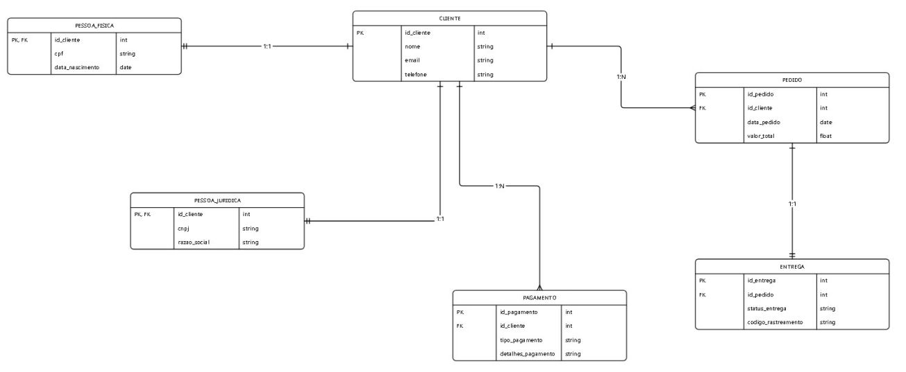

# Modelo Conceitual - Banco de Dados para E-commerce

## 💡 Objetivo do projeto
Este projeto representa um modelo conceitual de banco de dados para um sistema de e-commerce. Ele foi desenvolvido como parte do desafio do Bootcamp "Inteligência Artificial Aplicada a Dados com Copilot" da DIO.

## 📌 Descrição do Desafio
O esquema deverá ser adicionado a um repositório do Github para futura avaliação do desafio de projeto. Adicione ao Readme a descrição do projeto conceitual para fornecer o contexto sobre seu esquema.

Refine o modelo apresentado acrescentando os seguintes pontos:

Cliente PJ e PF – Uma conta pode ser PJ ou PF, mas não pode ter as duas informações;
Pagamento – Pode ter cadastrado mais de uma forma de pagamento;
Entrega – Possui status e código de rastreio;
Agora é a sua vez de ser o protagonista! Implemente o desafio sugerido pela expert e suba seu projeto para um repositório próprio, com isso, você aumentará ainda mais seu portfólio de projetos no GitHub!

## 🎯 Requisitos Atendidos

- Cadastro de cliente como **Pessoa Física (PF)** ou **Pessoa Jurídica (PJ)**, mas não ambos.
- Cada cliente pode ter **várias formas de pagamento**.
- Cada pedido possui uma **entrega com status** e **código de rastreamento**.

## 🔎 Entidades e Relacionamentos

- **Cliente**
- **Pessoa Física** (1:1 com Cliente)
- **Pessoa Jurídica** (1:1 com Cliente)
- **Pagamento** (1:N com Cliente)
- **Pedido** (1:N com Cliente)
- **Entrega** (1:1 com Pedido)

## 🖼️ Diagrama

